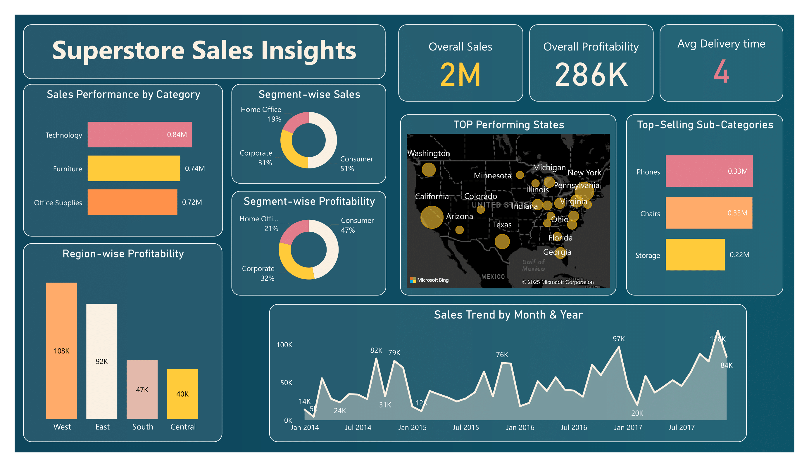
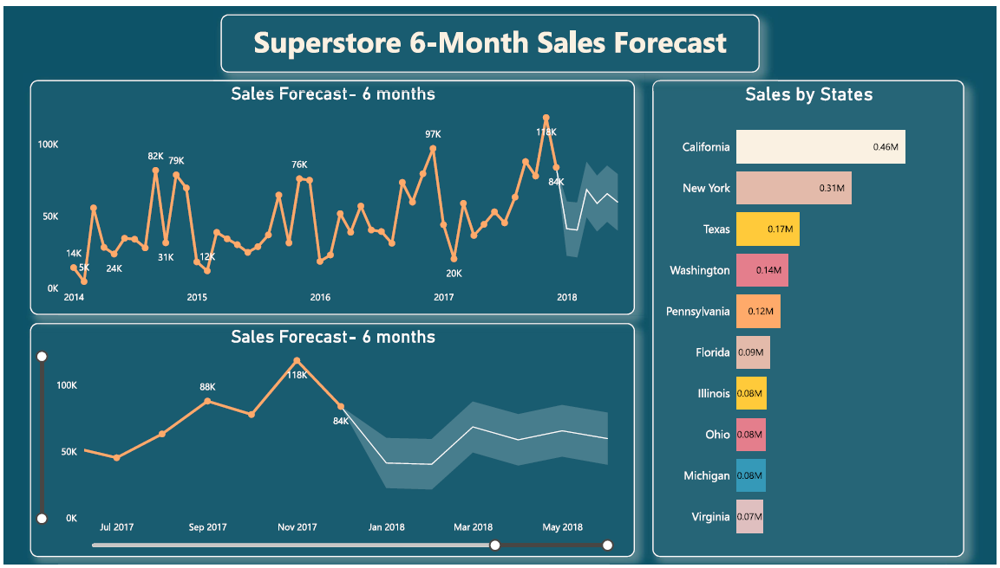

# 📊 Superstore End-to-End Data Analytics Project


---

# 📌 Project Overview

This project demonstrates an **end-to-end Data Analytics workflow** using the Superstore Sales dataset. The objective is to transform raw sales data into meaningful business insights through data cleaning, SQL analysis, and interactive Power BI dashboards.

The project follows a complete analytics pipeline—from preparing the raw dataset to building an executive dashboard for decision-making.

---

# 🎯 Business Objective

The primary objectives of this project are:

- Clean and prepare raw sales data.
- Perform data quality checks.
- Analyze sales and profitability.
- Identify top-performing products and customers.
- Evaluate regional and category performance.
- Understand customer purchasing behavior.
- Build an interactive dashboard.
- Generate actionable business insights for decision-making.

---

# 🛠️ Tools & Technologies

- Microsoft Excel
- Power Query
- MySQL
- Power BI
- Git
- GitHub

---

# 📂 Dataset Information

**Dataset Name:** Sample Superstore Dataset

The dataset contains transactional sales records including:

- Orders
- Customers
- Products
- Categories
- Sales
- Profit
- Discount
- Region
- Shipping Details

---

# 🔄 Project Workflow

```text
Raw Dataset
      │
      ▼
Excel Data Cleaning
      │
      ▼
Power Query Transformation
      │
      ▼
MySQL Data Analysis
      │
      ▼
Power BI Dashboard
      │
      ▼
Business Insights
```

---

# 🧹 Data Cleaning (Excel & Power Query)

The dataset was cleaned before analysis using Excel and Power Query.

### Cleaning Steps

- Removed duplicate records
- Checked missing values
- Standardized data formats
- Converted date columns
- Corrected data types
- Renamed columns
- Validated data consistency
- Prepared data for SQL analysis

---

# 🗄️ SQL Analysis

SQL was used to perform exploratory data analysis and answer business questions.

### SQL Concepts Used

- SELECT
- WHERE
- ORDER BY
- GROUP BY
- HAVING
- Aggregate Functions
- CASE WHEN
- Subqueries
- Common Table Expressions (CTEs)
- Window Functions
- Date Functions
- Ranking Functions

---

# 📈 Business Analysis Performed

The project includes analysis on:

- Overall Sales Performance
- Profit Analysis
- Customer Analysis
- Product Performance
- Category Analysis
- Sub-Category Analysis
- Regional Analysis
- State-wise Analysis
- Shipping Mode Analysis
- Discount Impact
- Monthly Sales Trend
- Top Customers
- Top Products
- Running Total Analysis
- Ranking Analysis
- Business Insights

---

# 📊 Power BI Dashboard

The interactive dashboard includes:

- KPI Cards
- Total Sales
- Total Profit
- Total Orders
- Sales by Category
- Sales by Region
- Profit by Category
- Monthly Sales Trend
- Top Products
- Top Customers
- Interactive Filters & Slicers

---

# 💡 Key Business Insights

Some important insights generated during the analysis:

- Technology category generated the highest sales.
- The West region contributed the highest revenue.
- Consumer segment generated the largest share of sales.
- Higher discounts negatively affected profitability.
- Standard Class was the most frequently used shipping mode.
- A small group of customers contributed a significant portion of total revenue.
- Sales showed seasonal trends that can support demand forecasting.

---

# 📁 Repository Structure

```text
Superstore-End-to-End-Data-Analytics-Project
│
├── README.md
├── Superstore_analysis_queries.sql
├── superstore_cleaned.csv
├── superstore_dataset_original.csv
├── superstore_sales_dashboard.pbix
├── superstore_sales_dashboard.png
└── Superstore_sales_forecast.png
```

---

# 📷 Dashboard Preview

## Sales Dashboard



## Sales Forecast



---

# 🚀 Skills Demonstrated

- Data Cleaning
- Data Transformation
- Exploratory Data Analysis (EDA)
- SQL Query Writing
- Business Analysis
- Window Functions
- CTEs
- Dashboard Design
- Data Visualization
- KPI Reporting
- Analytical Thinking
- Business Insight Generation

---

# 🎯 Project Outcome

This project demonstrates my ability to work on a complete data analytics pipeline—from cleaning raw data to building an interactive dashboard and generating business insights. It showcases practical skills in Excel, Power Query, SQL, and Power BI for solving real-world business problems.

---

# 📬 Contact

**Sonu Kumar**

Aspiring Data Analyst

### Skills

- SQL
- Excel
- Power BI
- Python
- Data Analytics

### Connect with Me

- LinkedIn: https://www.linkedin.com/in/sonu-kumar-0a6484353
- GitHub: https://github.com/sonukumar-96

---

⭐ If you found this project helpful, feel free to star the repository.
